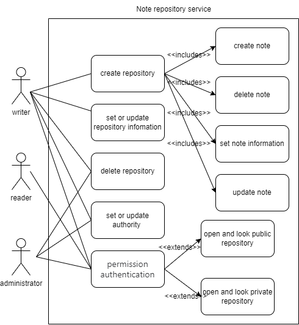

# Milestone2-

## Team127

### Members: 李子南，汪昱，张艺严，陈建宇，龚明道

### Requirements Modeling & Design

#### 1. Use Case Diagram

Forum & User use cases

Repository & note use cases

#### 2. Swimlane Diagram

#### 3. Natural Language Design

Use Case Name: Moderation

Description: This use case describes the actions that moderators can take to moderate posts and topics on the forum site.

Trigger: A post or topic is reported by a user, or a moderator identifies a post or topic that violates the forum rules.

Entry Conditions: The moderator must be logged into their account and have the authority to moderate posts and topics.

Basic Flow:

1.  The moderator identifies a post or topic that violates the forum rules.
2.  The moderator accesses the post or topic and views its content.
3.  The moderator decides whether to edit or delete the post or topic.
4.  If the post or topic can be edited, the moderator makes the necessary changes and saves the updated content.
5.  If the post or topic cannot be edited or the content is unacceptable, the moderator deletes the post or topic.
6.  The moderator notifies the user who created the post or topic about the moderation action taken and the reason behind it.

Alternate Flow:

1.  If the moderator is uncertain about whether the post or topic violates the forum rules, they can consult with other moderators or site administrators.
2.  If the moderator decides to edit the post or topic, but the user who created it objects to the changes, the moderator may choose to revert the post or topic to its original state.
3.  If the user who created the post or topic objects to the moderation action taken by the moderator, they may appeal the decision to the site administrators.

Exception Flow:

1.  If the moderator encounters technical difficulties while moderating a post or topic, they may report the issue to the site administrators for resolution.
2.  If the moderator encounters abusive or threatening behavior from a user while moderating a post or topic, they may report the behavior to the site administrators and take appropriate action to protect themselves and other users.

#### 4. Diagram for Logical View

#### 5. Data Design

#### 6. UI Design

### Collaborations

### Deliverables