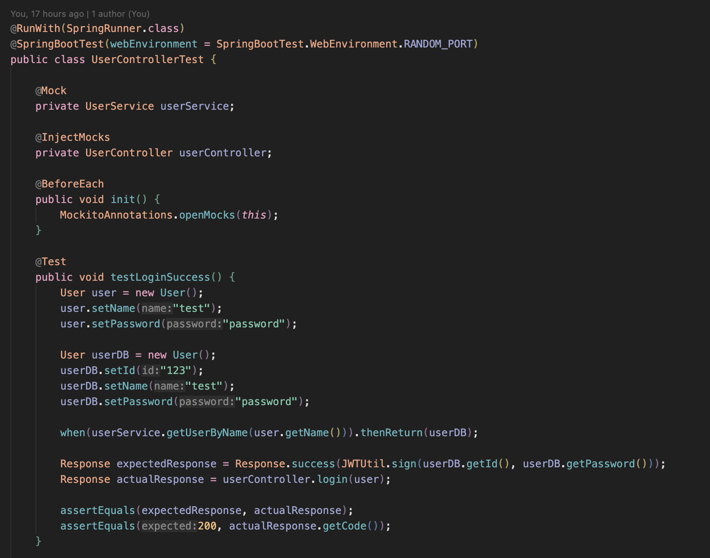

# CS304_2023S_SUSTech_Software_Engineering

## 1. Metrics

Lines of Code: 6207(Backend)

Number of modules/subprojects:  0(Backend)

Number of packages: 8(Backend)

Number of source files: 58(Backend)

Number of 3rd party dependencies: 181(Backend) using `mvn dependency:tree`

#### Maintainability

**Take apache/tomcat as a example:**

Lines of Code: 501444

Number of modules/subprojects:  7

Number of packages: 156

Number of source files: 4386

Number of 3rd party dependencies: 374 


The comparison shows that Tomcat is significantly larger and more complex than your project in terms of lines of code. This suggests that Tomcat likely has a larger codebase with more features and functionality.

Tomcat is structured into multiple modules/subprojects, while our project seems to be a single, standalone project without any explicit modularization.

Tomcat has a larger number of packages compared to your project, indicating a more modular and organized codebase.

Again, Tomcat has a significantly higher number of source files, suggesting a more extensive codebase.

Tomcat has a larger number of 3rd party dependencies compared to your project, indicating a higher reliance on external libraries and frameworks.

-   Tomcat's maintainability might be more challenging due to its larger codebase, higher complexity, and the need to manage multiple modules/subprojects. The extensive use of 3rd party dependencies could also introduce additional maintenance efforts, such as staying up-to-date with library updates and managing compatibility issues.
-   Our project, being smaller in size, has the advantage of being potentially easier to maintain. With fewer lines of code, source files, and dependencies, it may require less effort for maintenance tasks such as bug fixing, adding new features, and understanding the codebase.

## 2. Documentation

### 	2.1 Documentation for end users

SUSTech learning note management system is a free note management system for all teachers and students at South University of Science and Technology, and provides a platform for learning and communication. Next, we will introduce the main functions provided by our software and the specific interaction interfaces used.

##  Home Page 


## User Page


### Function Introduction

1. User management operations, creating repository or notes

2. User permission function, for accessing their own homepage, users can modify or delete repository or notes

3. View your star's repository and notes

4. Setting and changing personal information

## Chat Page


### Function Introduction

1. Can chat with friends in real-time

2. Connect to artificial intelligence and ask questions from an AI assistant

3. Provide non-public information exchange

## Reader Page


### Function Introduction

1. Can start the current text

2. The preview format viewed is a markdown rendering, supporting interaction with various charts and formulas

3. It can be directly copied or exported in PDF format, etc

## Editor Page


### Function Introduction

1.  Support facial expression rendering in markup format and basic operations

2.  Support for code pasting and highlighting

3.  Support the writing and rendering of scientific formulas

4.  Support online rendering of flow chart, Gantt chart chart, sequence chart and other charts

5.  Support text editing, automatic saving, and version rollback

6.  Support for directly loading local MD files

7.  The system implements a stable graph bed for displaying images in MD format

## Forum Page


1. Provide a platform for public discussion of issues

2. Multilevel comments and answers help to discuss issues

3. Support for collecting and liking excellent answers

4. Intelligent recommendation issues and users

### 	2.2 Documentation for developers

## 3. Tests

-   Our project uses two testing tools: **JUnit** and **Mockito**. **Unit tests** are used in our backend project to test individual units of code, such as methods or classes, in isolation from the rest of the system. As for our frontend, we test manually for each function to make sure it perform in a right way.
-   Testcode screenshot: 
    

-   Test result
    
    Test coverage
    
    It's strange that the test coverage of package service.impl is so low. We write lots of test for service to verify the usability and robustness of the project. I guess the reson for this strange result maybe the @Mock class, jacoco may miss the class with @Mock annotation.

## 4.  Build

We use the **Maven** to automate build process to compile source code, and we use the command `mvn package` to generate a jar file of our project.

```xml
<?xml version="1.0" encoding="UTF-8"?>
<project xmlns="http://maven.apache.org/POM/4.0.0" xmlns:xsi="http://www.w3.org/2001/XMLSchema-instance"
         xsi:schemaLocation="http://maven.apache.org/POM/4.0.0 https://maven.apache.org/xsd/maven-4.0.0.xsd">
    <modelVersion>4.0.0</modelVersion>
    <parent>
        <groupId>org.springframework.boot</groupId>
        <artifactId>spring-boot-starter-parent</artifactId>
        <version>2.7.2</version>
        <relativePath/> <!-- lookup parent from repository -->
    </parent>
    <groupId>com.team.project127</groupId>
    <artifactId>Atom_backend</artifactId>
    <version>0.0.1-SNAPSHOT</version>
    <name>SE-Learning_backend</name>
    <description>SE-Learning_backend</description>
    <properties>
        <java.version>17</java.version>
    </properties>
    <dependencies>
        <dependency>
            <groupId>org.springframework.boot</groupId>
            <artifactId>spring-boot-starter-data-mongodb</artifactId>
        </dependency>
        <dependency>
            <groupId>org.springframework.boot</groupId>
            <artifactId>spring-boot-starter-data-redis</artifactId>
        </dependency>
        <dependency>
            <groupId>redis.clients</groupId>
            <artifactId>jedis</artifactId>
        </dependency>
        <dependency>
            <groupId>org.springframework.boot</groupId>
            <artifactId>spring-boot-starter-web</artifactId>
        </dependency>
        <dependency>
            <groupId>org.mybatis.spring.boot</groupId>
            <artifactId>mybatis-spring-boot-starter</artifactId>
            <version>3.0.1</version>
        </dependency>
        <dependency>
            <groupId>org.springframework.boot</groupId>
            <artifactId>spring-boot-devtools</artifactId>
            <scope>runtime</scope>
            <optional>true</optional>
        </dependency>
        <dependency>
            <groupId>mysql</groupId>
            <artifactId>mysql-connector-java</artifactId>
            <scope>runtime</scope>
        </dependency>
        <dependency>
            <groupId>org.projectlombok</groupId>
            <artifactId>lombok</artifactId>
            <optional>true</optional>
        </dependency>
        <dependency>
            <groupId>org.springframework.boot</groupId>
            <artifactId>spring-boot-starter-test</artifactId>
            <scope>test</scope>
        </dependency>
        <dependency>
            <groupId>org.springframework.restdocs</groupId>
            <artifactId>spring-restdocs-mockmvc</artifactId>
            <scope>test</scope>
        </dependency>
        <!--websocket依赖-->
        <dependency>
            <groupId>org.springframework.boot</groupId>
            <artifactId>spring-boot-starter-websocket</artifactId>
            <version>2.4.1</version>
        </dependency>
        <dependency>
            <groupId>org.mybatis.generator</groupId>
            <artifactId>mybatis-generator-core</artifactId>
            <version>1.4.2</version>
        </dependency>
        <dependency>
            <groupId>com.alibaba</groupId>
            <artifactId>druid-spring-boot-starter</artifactId>
            <version>1.2.16</version>
        </dependency>

        <!--Swagger-->
        <dependency>
            <groupId>io.springfox</groupId>
            <artifactId>springfox-swagger2</artifactId>
            <version>2.9.2</version>
        </dependency>
        <dependency>
            <groupId>io.springfox</groupId>
            <artifactId>springfox-swagger-ui</artifactId>
            <version>2.9.2</version>
        </dependency>

        <!--JWT-->
        <dependency>
            <groupId>com.auth0</groupId>
            <artifactId>java-jwt</artifactId>
            <version>4.3.0</version>
        </dependency>

        <!-- Apache Commons -->
        <dependency>
            <groupId>org.apache.commons</groupId>
            <artifactId>commons-lang3</artifactId>
            <version>${commons-lang3.version}</version>
        </dependency>

        <dependency>
            <groupId>com.alibaba</groupId>
            <artifactId>fastjson</artifactId>
            <version>1.2.83</version>
        </dependency>

        <dependency>
            <groupId>org.springframework.boot</groupId>
            <artifactId>spring-boot-starter-data-jdbc</artifactId>
            <version>3.0.5</version>
        </dependency>

        <dependency>
            <groupId>org.springframework.boot</groupId>
            <artifactId>spring-boot-starter-cache</artifactId>
        </dependency>
        <dependency>
            <groupId>com.google.code.gson</groupId>
            <artifactId>gson</artifactId>
            <version>2.8.9</version>
        </dependency>

        <dependency>
            <groupId>io.github.asleepyfish</groupId>
            <artifactId>chatgpt</artifactId>
            <version>1.1.6</version>
        </dependency>

        <dependency>
            <groupId>cn.hutool</groupId>
            <artifactId>hutool-all</artifactId>
            <version>5.8.18</version>
        </dependency>

        <dependency>
            <groupId>org.springframework.boot</groupId>
            <artifactId>spring-boot-starter-tomcat</artifactId>
            <scope>provided</scope>
        </dependency>

        <dependency>
            <groupId>junit</groupId>
            <artifactId>junit</artifactId>
            <version>4.13.2</version>
        </dependency>
    </dependencies>
    <build>
        <plugins>
            <plugin>
                <groupId>org.asciidoctor</groupId>
                <artifactId>asciidoctor-maven-plugin</artifactId>
                <version>2.2.1</version>
                <executions>
                    <execution>
                        <id>generate-docs</id>
                        <phase>prepare-package</phase>
                        <goals>
                            <goal>process-asciidoc</goal>
                        </goals>
                        <configuration>
                            <backend>html</backend>
                            <doctype>book</doctype>
                        </configuration>
                    </execution>
                </executions>
                <dependencies>
                    <dependency>
                        <groupId>org.springframework.restdocs</groupId>
                        <artifactId>spring-restdocs-asciidoctor</artifactId>
                        <version>${spring-restdocs.version}</version>
                    </dependency>
                </dependencies>
            </plugin>
            <plugin>
                <groupId>org.springframework.boot</groupId>
                <artifactId>spring-boot-maven-plugin</artifactId>
                <configuration>
                    <excludes>
                        <exclude>
                            <groupId>org.projectlombok</groupId>
                            <artifactId>lombok</artifactId>
                        </exclude>
                    </excludes>
                </configuration>
            </plugin>
            <plugin>
                <groupId>org.mybatis.generator</groupId>
                <artifactId>mybatis-generator-maven-plugin</artifactId>
                <version>1.3.7</version>
                <dependencies>
                    <dependency>
                        <groupId>mysql</groupId>
                        <artifactId>mysql-connector-java</artifactId>
                        <version>8.0.25</version>
                    </dependency>
                </dependencies>
                <configuration>
                    <!--允许移动生成的文件-->
                    <verbose>true</verbose>
                    <!--允许自动覆盖文件,第一次可覆盖，以后都不可覆盖-->
                    <overwrite>true</overwrite>
                    <!-- 自定义配置文件的名称  默认是generatorConfig.xml -->
                    <configurationFile>
                        src/main/resources/generatorConfig.xml
                    </configurationFile>
                </configuration>
            </plugin>
            <!--            docker-->
            <plugin>
                <groupId>com.spotify</groupId>
                <artifactId>docker-maven-plugin</artifactId>
                <version>1.2.2</version>
                <executions>
                    <execution>
                        <id>build-image</id>
                        <phase>package</phase>
                        <goals>
                            <goal>build</goal>
                        </goals>
                    </execution>
                </executions>
                <configuration>
                    <dockerHost>http://ip:2375</dockerHost>
                    <imageName>itwanger/${project.artifactId}</imageName>
                    <imageTags>
                        <imageTag>${project.version}</imageTag>
                    </imageTags>
                    <forceTags>true</forceTags>
                    <dockerDirectory>${project.basedir}</dockerDirectory>
                    <resources>
                        <resource>
                            <targetPath>/</targetPath>
                            <directory>${project.build.directory}</directory>
                            <include>${project.build.finalName}.jar</include>
                        </resource>
                    </resources>
                </configuration>
            </plugin>
        </plugins>
    </build>
</project>

```


## 5. Deployment 

-   We use **Docker** as the containerization tool for our project. Docker is the most popular containerization platform. It allows you to package applications and their dependencies into lightweight, portable containers. Docker provides a standardized format for containers, making it easy to deploy and run applications across different environments.
-   Our Dockerfile is shown as below
    
    We use dockerfile-maven-plugin to simplify the containerization. Each time the project is built, the jar package will automatically add to docker.
-    Snapshot of a successful docker build
    


